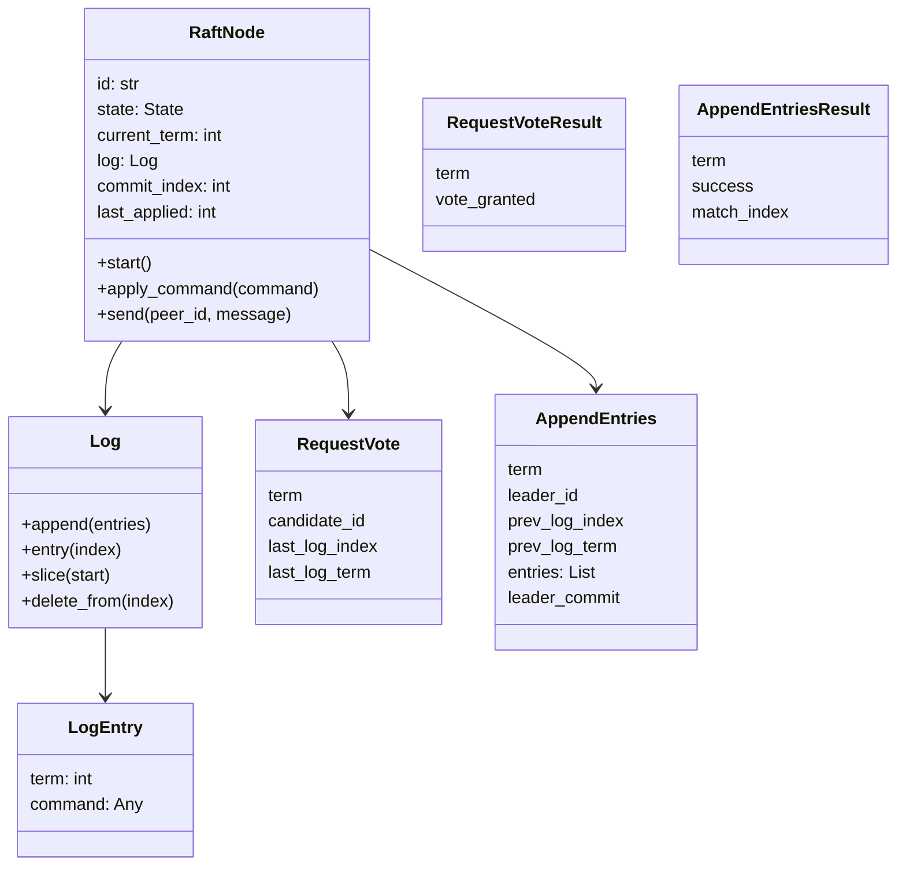
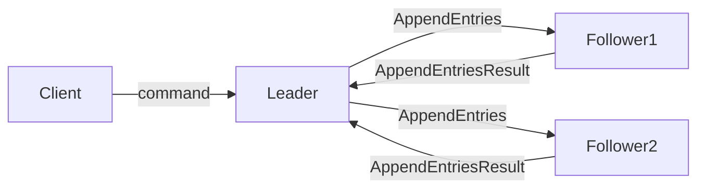
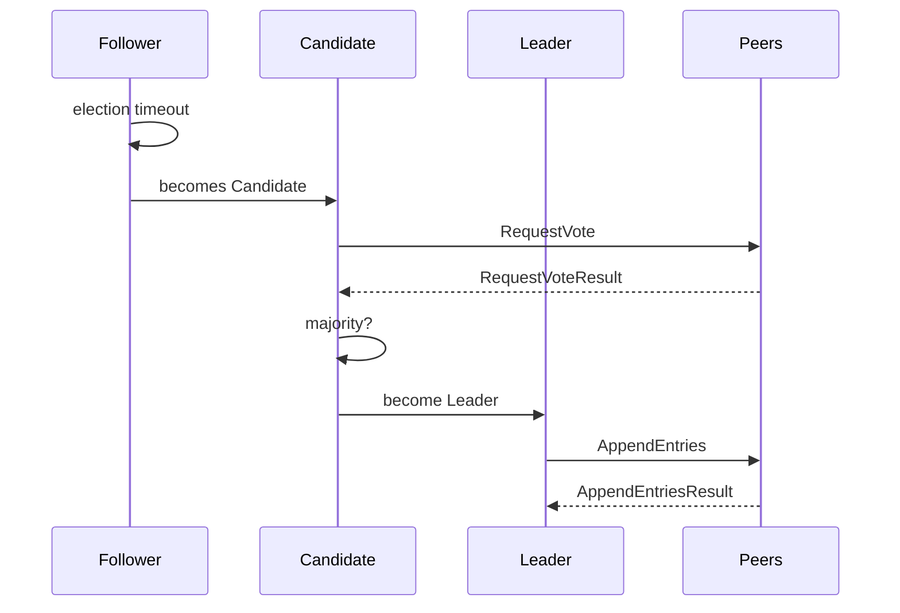

# Raft Implementation Overview

## Class Diagram

## Architecture Diagram

## Flow Diagram

## Operations

### Leader Election
1. A follower times out and becomes a candidate.
2. Candidate increments term and requests votes.
3. Peers grant vote if log is up-to-date and they haven't voted.
4. Candidate becomes leader upon majority.

### Log Replication
1. Client sends a command to the leader.
2. Leader appends command as a new log entry.
3. Leader sends AppendEntries RPCs to followers.
4. Followers append entry and respond.
5. Once entry is replicated on majority, leader commits and applies it.
